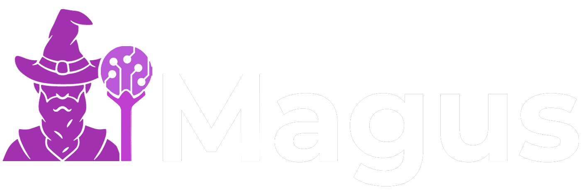
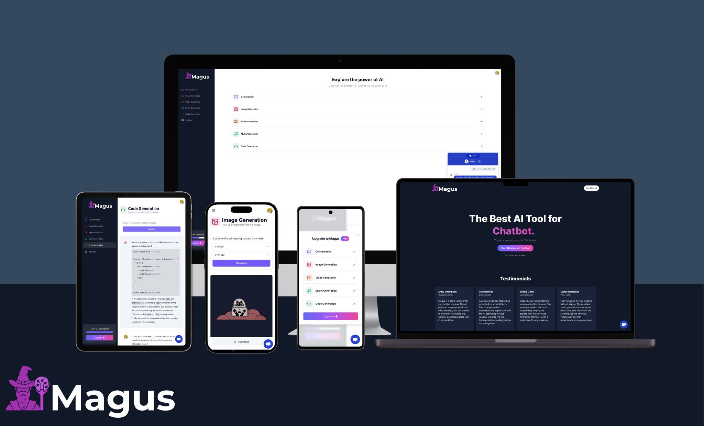

<div align="center">
  
</div>

# Magus

Magus: Unleash the power of AI magic! Chat with an intelligent assistant, generate images, videos, music, and code effortlessly. Magus is your ultimate AI magician, offering a myriad of tools to enhance your creative and problem-solving capabilities.

## Demo

Magus is deployed to Vercel. You can try it on the following URL: [magus-ai.vercel.app](https://magus-ai.vercel.app/).

<div align="center">
  
</div>

## Technologies Used

- React.js
- Next.js
- TypeScript
- OpenAI API
- Replicate
- Prisma
- Clerk
- Tailwind
- Shadcn/UI
- React Hook Form
- Zustand

## Installation

To install and run Magus locally, follow these steps:

1. Clone the project repository.

2. Install the necessary dependencies by running the following command:

```
npm install
```

3. Replace the environment variables with your own API keys and database URL.

4. Push tables to your database

```
npx prisma db push
```

5. Generate prisma client

```
npx prisma generate
```

6. Run the project by executing the following command:

```
npm run dev
```

7. Access the application by visintg http://localhost:3000/
